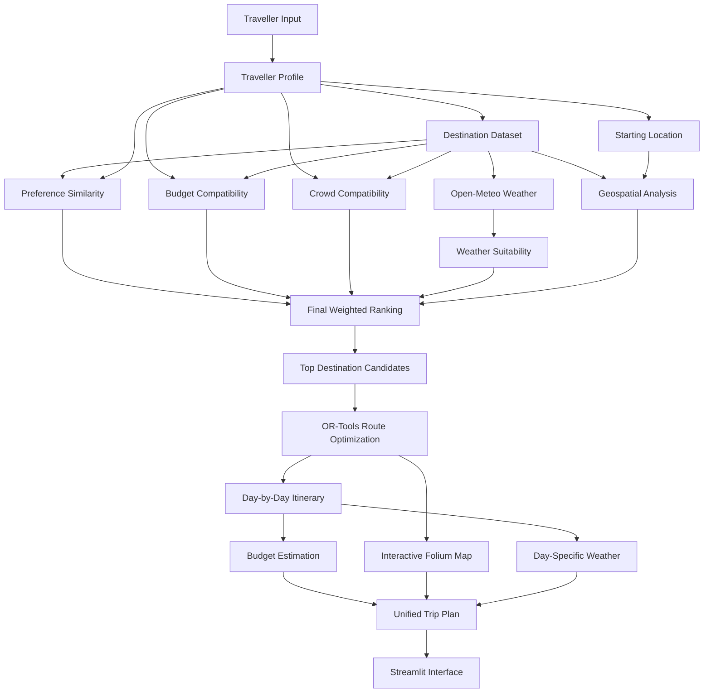

# 🇱🇰 CeylonCompass

### Smart Sri Lanka Travel Recommendation & Route Optimization Platform

CeylonCompass is a data-driven travel planning system that recommends Sri Lankan destinations based on traveller preferences, budget, crowd preference, live weather and geographic efficiency, then optimizes the visit sequence and produces an explainable day-by-day itinerary.

The project combines **recommendation systems, geospatial analytics, optimization, weather intelligence, explainable scoring and interactive visualization** in one end-to-end data science application.

---

## Project Problem

Planning a multi-destination trip across Sri Lanka involves several decisions:

- Which destinations match the traveller's interests?
- Which places are affordable within the available budget?
- Which destinations suit the traveller's crowd preference?
- What are the current weather conditions?
- Which recommended destinations are geographically practical?
- In what order should the destinations be visited?
- Can the selected locations fit within the available trip duration?
- What will the estimated trip cost be?

Many simple travel recommendation applications answer only:

> "Where should I go?"

CeylonCompass addresses a broader planning problem:

> **Given a traveller's budget, number of days, interests, travel style, crowd preference, transport preference and starting location, which Sri Lankan destinations should they visit, in what order, and why?**

---

# Core Features

## 1. Traveller Preference Profiling

Users create a structured travel profile using:

- starting location
- trip duration
- total budget
- travel style
- crowd preference
- transport preference
- travel interests

Supported interest dimensions include:

- Beach
- Wildlife
- Hiking
- Nature
- Culture
- History
- Adventure

---

## 2. Destination Recommendation Engine

CeylonCompass represents both traveller interests and destination characteristics as feature vectors.

Destination relevance is initially calculated using **cosine similarity** between:

```text
Traveller Interest Vector
          ↓
Cosine Similarity
          ↓
Destination Feature Vector
```

This produces an interpretable preference-alignment score for each destination.

---

## 3. Multi-Criteria Weighted Ranking

Final recommendations are ranked using five components:

| Component | Weight |
|---|---:|
| Preference similarity | 45% |
| Budget compatibility | 20% |
| Weather suitability | 15% |
| Crowd compatibility | 10% |
| Route efficiency | 10% |

The complete model is:

```text
Final Score =
0.45 × Preference Score
+ 0.20 × Budget Score
+ 0.15 × Weather Score
+ 0.10 × Crowd Score
+ 0.10 × Route Efficiency Score
```

### Dynamic Weight Normalization

Not every component is always available.

For example:

- if live weather cannot be retrieved, the weather component is excluded;
- if the traveller selects **No Preference** for crowds, the crowd component is excluded.

The remaining active components are automatically normalized rather than artificially assigning a perfect score to unavailable or irrelevant criteria.

---

## 4. Explainable Recommendations

The platform does not only show a ranking.

For each major recommendation, it explains:

- matching traveller interests
- budget compatibility
- crowd compatibility
- geographic considerations
- potential trade-offs
- active ranking weights

This makes the recommendation process easier to inspect and understand.

---

## 5. Geographic Route Efficiency

Before final recommendation ranking, CeylonCompass calculates a geographic route-efficiency proxy.

It considers:

- distance from the traveller's starting point
- average distance to other candidate destinations

This helps avoid selecting a group of individually relevant destinations that are geographically impractical as a trip.

The current implementation uses **Haversine great-circle distance**.

> Route-efficiency scoring is a candidate-selection heuristic, not actual road navigation.

---

## 6. OR-Tools Route Optimization

After destination selection, the project uses **Google OR-Tools** to optimize the visit sequence.

The optimization stage answers:

> In what order should the selected destinations be visited?

The recommendation system and route optimizer therefore perform separate tasks:

```text
Recommendation Engine → WHERE to visit
Route Optimizer       → IN WHAT ORDER to visit
```

The project also contains a **nearest-neighbour baseline** for quantitative route comparison.

---

## 7. Day-by-Day Itinerary Planning

The optimized destination route is converted into a practical itinerary.

The planner:

- preserves optimized route order
- assigns destinations to trip days
- respects the current 8-hour daily activity limit
- identifies locations that cannot fit within the selected trip duration
- preserves visit order within each day

Current V1 scheduling constrains **activity time only**.

Travel time is not yet included in the daily-hour limit.

---

## 8. Budget Estimation

The budget engine estimates:

- destination costs
- transport costs
- total trip cost
- remaining budget or budget deficit
- whether the generated itinerary remains within budget

Travel styles use transparent modelling factors:

```text
Budget
Balanced
Comfort
```

Transport modes use explicit per-kilometre assumptions:

```text
Public Transport
Mixed Transport
Private Vehicle
```

These values are modelling assumptions for V1 and are not claimed to be guaranteed current market prices.

---

## 9. Live Weather Intelligence

CeylonCompass integrates the **Open-Meteo API** for weather-aware travel planning.

Weather suitability considers:

- weather condition
- precipitation probability
- expected precipitation
- temperature

The V1 weather score uses:

| Weather Component | Weight |
|---|---:|
| General condition | 40% |
| Rain probability | 30% |
| Precipitation amount | 20% |
| Temperature | 10% |

Weather contributes to destination ranking and is also attached to scheduled itinerary days.

Forecast requests are cached to reduce unnecessary API calls.

---

## 10. Interactive Travel Map

The application uses:

- Folium
- OpenStreetMap
- streamlit-folium

The map displays:

- traveller starting location
- numbered destination markers
- optimized visit sequence
- destination information
- geographic route polyline

The route line is a straight geographic visualization connecting optimized destinations.

It is **not turn-by-turn road geometry**.

---

# System Architecture



---

# Unified Planning Pipeline

The application uses a centralized planning service rather than allowing the UI to independently perform each calculation.

```text
Traveller Profile
       ↓
Initial Candidate Recommendation
       ↓
Weather Retrieval
       ↓
Final Multi-Criteria Ranking
       ↓
Top Route Candidates
       ↓
OR-Tools Route Optimization
       ↓
Day-by-Day Itinerary
       ↓
Budget Estimation
       ↓
Interactive Map
       ↓
Unified TripPlan
```

This keeps the recommendation logic separate from presentation logic and makes the pipeline easier to test.

---

# Dataset

The project currently contains **48 curated Sri Lankan destinations**.

The dataset includes:

```text
destination_id
name
district
province
latitude
longitude
category
estimated_daily_cost_usd
recommended_duration_hours
crowd_level
beach
wildlife
hiking
nature
culture
history
adventure
fitness_requirement
family_suitability
best_months
```

Destination categories include:

- Beach
- Heritage
- Wildlife
- Nature
- Hiking
- Culture
- Adventure

### Important Dataset Note

Geographic and descriptive information can be externally verified.

However, fields such as destination interest strengths, crowd levels, fitness requirements and similar recommendation features are **curated model inputs**.

They should not be interpreted as objective ground-truth labels.

---

# Data Science & Algorithmic Methods

CeylonCompass currently uses:

### Recommendation Systems

- feature-vector representation
- cosine similarity
- multi-criteria weighted ranking

### Geospatial Analytics

- latitude/longitude coordinates
- Haversine distance
- candidate-cluster proximity
- distance matrices

### Optimization

- Google OR-Tools
- routing model
- nearest-neighbour baseline comparison

### Explainable AI

- component-level scores
- recommendation reasons
- trade-off explanations
- transparent active weights

### Weather Intelligence

- Open-Meteo forecasts
- weather-code interpretation
- weighted suitability scoring

### Evaluation

- fixed synthetic traveller profiles
- deterministic weather conditions
- budget compliance
- itinerary compliance
- route validity
- category diversity
- recommendation-score analysis
- baseline-vs-optimizer comparison

---

# Quantitative Evaluation

CeylonCompass V1 was evaluated using **30 fixed traveller scenarios**.

The scenarios vary across:

- starting locations
- budgets
- travel styles
- trip durations
- crowd preferences
- transport methods
- travel interests

## Measured Results

| Metric | Result |
|---|---:|
| Mean preference similarity | **82.63%** |
| Mean final recommendation score | **85.06%** |
| Mean category diversity | **47.33%** |
| Budget compliance | **96.67%** |
| Duration compliance | **100.00%** |
| Mean scheduled-destination coverage | **82.38%** |
| Controlled-weather coverage | **100.00%** |
| Mean controlled-weather score | **80.86%** |
| Route structural validity | **100.00%** |
| Mean OR-Tools distance saving | **4.47%** |
| OR-Tools not-worse-than-baseline rate | **100.00%** |

### Route Optimization Result

Across the 30 evaluation scenarios, OR-Tools produced an average:

```text
4.47% Haversine-distance reduction
```

relative to the nearest-neighbour route baseline.

The optimizer was **not worse than the baseline in any evaluated scenario**.

Some destination groups already had efficient nearest-neighbour routes and therefore produced little or no improvement.

This is reported as measured rather than artificially forcing a positive optimization gain.

---

# Evaluation Interpretation

The evaluation results must be interpreted carefully.

### Preference Similarity

The **82.63% preference score is not recommendation accuracy**.

It measures cosine similarity between:

```text
Traveller Interest Vector
and
Curated Destination Feature Vector
```

The project currently does not contain human-labelled relevance judgements.

Therefore metrics such as:

- Precision@K
- Recall@K
- NDCG

against real human relevance labels are not claimed.

### Weather Evaluation

The quantitative experiment uses **deterministic synthetic weather**.

This allows the complete weather-aware planner to be evaluated reproducibly.

It does not measure Open-Meteo forecast accuracy.

The deployed application itself uses live Open-Meteo forecast data.

---

# Findings From Evaluation

The experiment exposed useful V1 strengths and limitations.

## Strengths

- 100% itinerary duration compliance
- 100% route structural validity
- 100% controlled-weather coverage
- OR-Tools never produced a route worse than the baseline
- strong average internal preference alignment
- high overall modelled budget compliance

## Identified Limitations

### Short Trips

Short-trip scenarios achieved lower scheduled-destination coverage because the current planner can select up to seven route candidates even when only 2–3 travel days are available.

A future version should make the candidate count adaptive to trip duration.

### Budget Constraint

One low-budget scenario exceeded its total modelled budget.

Budget currently influences ranking but is not used as a strict global optimization constraint during destination selection.

A future version can introduce budget-constrained destination selection.

---

# Reproducible Evaluation Artifacts

Generated experiment outputs are stored under:

```text
evaluation/
├── results/
│   ├── scenario_results.csv
│   ├── segment_summary.csv
│   ├── overall_summary.json
│   └── evaluation_report.md
└── charts/
    ├── segment_scores.html
    ├── route_savings.html
    └── compliance_rates.html
```

To reproduce the complete evaluation:

```bash
python -m notebooks.evaluation_report
```

---

# Testing

The project contains automated tests covering:

- dataset validation
- traveller profiles
- recommendation scoring
- explainability
- geographic distance
- nearest-neighbour routing
- OR-Tools optimization
- itinerary generation
- budget estimation
- weather processing
- interactive map construction
- unified planning pipeline
- final weighted ranking
- evaluation scenarios
- quantitative metrics
- reporting and artifact generation

Current verified suite:

```text
244 passed
```

Run all tests using:

```bash
python -m pytest
```

---

# Technology Stack

| Area | Technology |
|---|---|
| Language | Python |
| UI | Streamlit |
| Data Processing | pandas, NumPy |
| Machine Learning | scikit-learn |
| Optimization | Google OR-Tools |
| Maps | Folium |
| Map Data | OpenStreetMap |
| Weather | Open-Meteo |
| Visualization | Plotly |
| HTTP | requests |
| Testing | pytest |
| Reporting | pandas, Plotly, tabulate |
| Version Control | Git + GitHub |

---

# Project Structure

```text
Ceylon-Compass/
│
├── app.py
├── requirements.txt
├── README.md
├── LICENSE
│
├── assets/
│   ├── architecture/
│   └── screenshots/
│
├── data/
│   ├── destinations.csv
│   └── README.md
│
├── evaluation/
│   ├── charts/
│   └── results/
│
├── notebooks/
│   ├── destination_analysis.py
│   ├── profile_scenarios.py
│   ├── explanation_scenarios.py
│   ├── route_comparison.py
│   └── evaluation_report.py
│
├── src/
│   ├── budget/
│   ├── evaluation/
│   ├── itinerary/
│   ├── optimization/
│   ├── planning/
│   ├── recommendation/
│   ├── utils/
│   ├── visualization/
│   └── weather/
│
└── tests/
```

---

# Installation

## 1. Clone the repository

```bash
git clone https://github.com/SMCodeX7/Ceylon-Compass.git
```

```bash
cd Ceylon-Compass
```

## 2. Create a virtual environment

Windows:

```powershell
python -m venv .venv
```

Activate it:

```powershell
.venv\Scripts\Activate.ps1
```

## 3. Install dependencies

```powershell
python -m pip install -r requirements.txt
```

## 4. Run the tests

```powershell
python -m pytest
```

## 5. Start CeylonCompass

```powershell
streamlit run app.py
```

The Streamlit application will open in your browser.

---

# Cost-Free Architecture

CeylonCompass V1 is intentionally designed to operate without paid AI or mapping APIs.

It uses:

- OpenStreetMap
- Folium
- Open-Meteo
- local Python data processing
- scikit-learn
- OR-Tools
- Streamlit

No paid OpenAI, Gemini, Claude or Mistral API is required for V1.

---

# Current V1 Limitations

CeylonCompass is a portfolio and research-oriented V1 system.

Current limitations include:

1. Destination recommendation features are curated rather than learned from large-scale user interaction data.
2. The dataset currently contains 48 Sri Lankan destinations.
3. Haversine distance is a geographic proxy rather than road distance.
4. The displayed map route is not turn-by-turn road geometry.
5. Daily itinerary limits include activity time but not travel time.
6. Budget estimates use transparent modelling assumptions rather than guaranteed market prices.
7. Budget is a ranking factor rather than a strict total-trip optimization constraint.
8. Route candidate count is not yet dynamically adjusted for very short trips.
9. Weather planning currently uses the present forecast horizon rather than a user-selected future departure date.
10. Human relevance labels are not yet available for recommendation evaluation.

---

# Future Work

## Recommendation Improvements

- collect human destination relevance labels
- evaluate Precision@K, Recall@K and NDCG
- learn ranking weights from interaction data
- adaptive route-candidate selection
- budget-constrained destination optimization
- traveller fitness and family-aware filtering

## Routing Improvements

- road-network routing
- travel-time estimation
- transport-specific route costs
- travel time inside daily itinerary constraints
- multi-objective route optimization

## Weather Improvements

- user-selected travel dates
- historical seasonal weather analysis
- weather-triggered itinerary replanning

## Phase 2 — Local AI Travel Assistant

A future cost-free AI layer can add:

- natural-language traveller profile extraction
- Sentence Transformers
- semantic destination search
- FAISS
- local RAG
- Ollama
- conversational itinerary modification
- tool-calling travel assistant
- multi-step itinerary replanning
- recommendation verification

The existing deterministic recommendation and optimization pipeline will remain the reliable planning foundation underneath the AI layer.

---

# Design Principle

CeylonCompass follows one important separation:

> **The recommender decides WHERE to travel.  
> The optimizer decides IN WHAT ORDER to travel.**

This prevents route sequencing from replacing traveller preference relevance and keeps the system easier to explain, test and evaluate.

---

# Evaluation Reproducibility

To reproduce the complete measured evaluation:

```powershell
python -m notebooks.evaluation_report
```

To run all automated tests:

```powershell
python -m pytest
```

---

# License

See the [LICENSE](LICENSE) file for repository licensing information.

---

## CeylonCompass

**Data-driven Sri Lanka travel planning with explainable recommendation, route optimization, weather intelligence and reproducible evaluation.**
