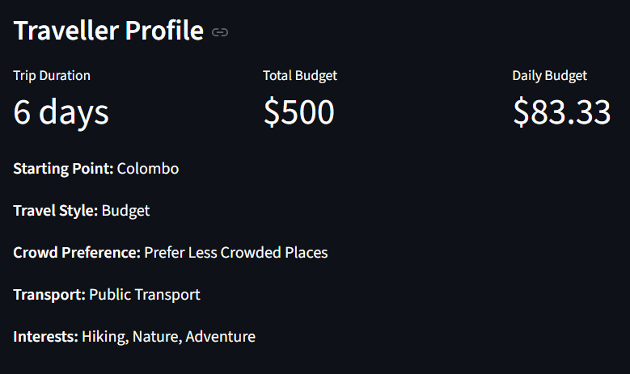
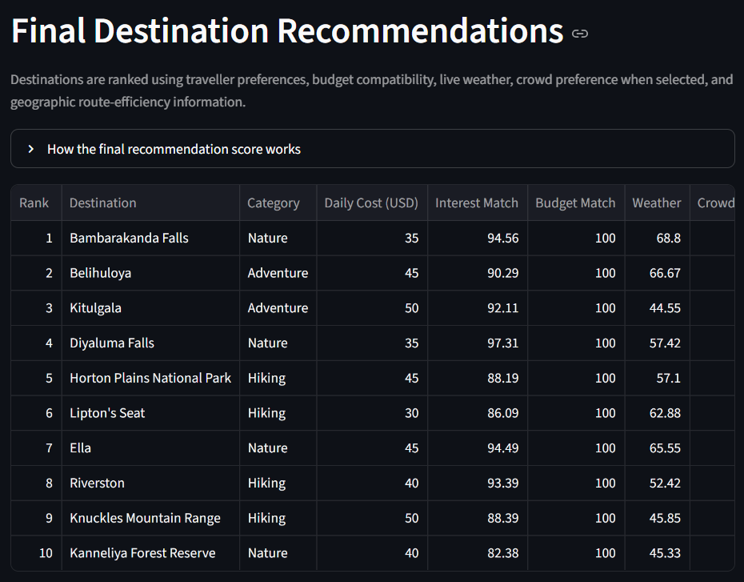
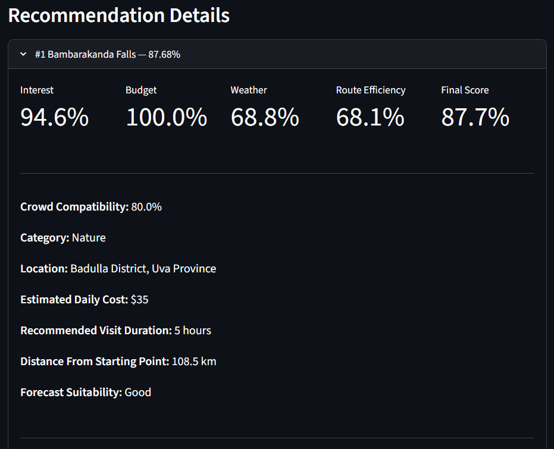
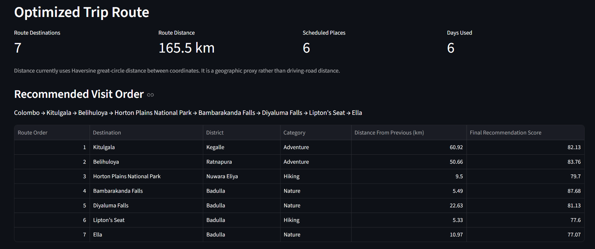
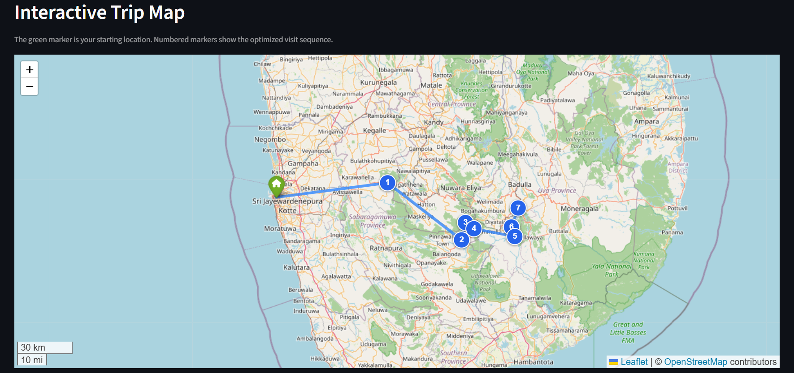
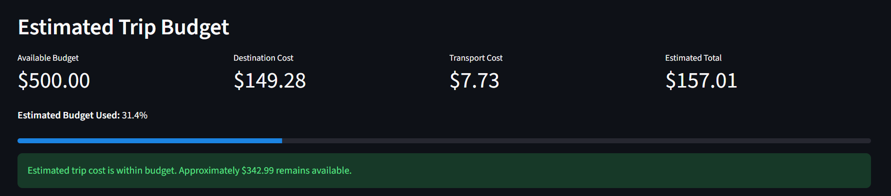
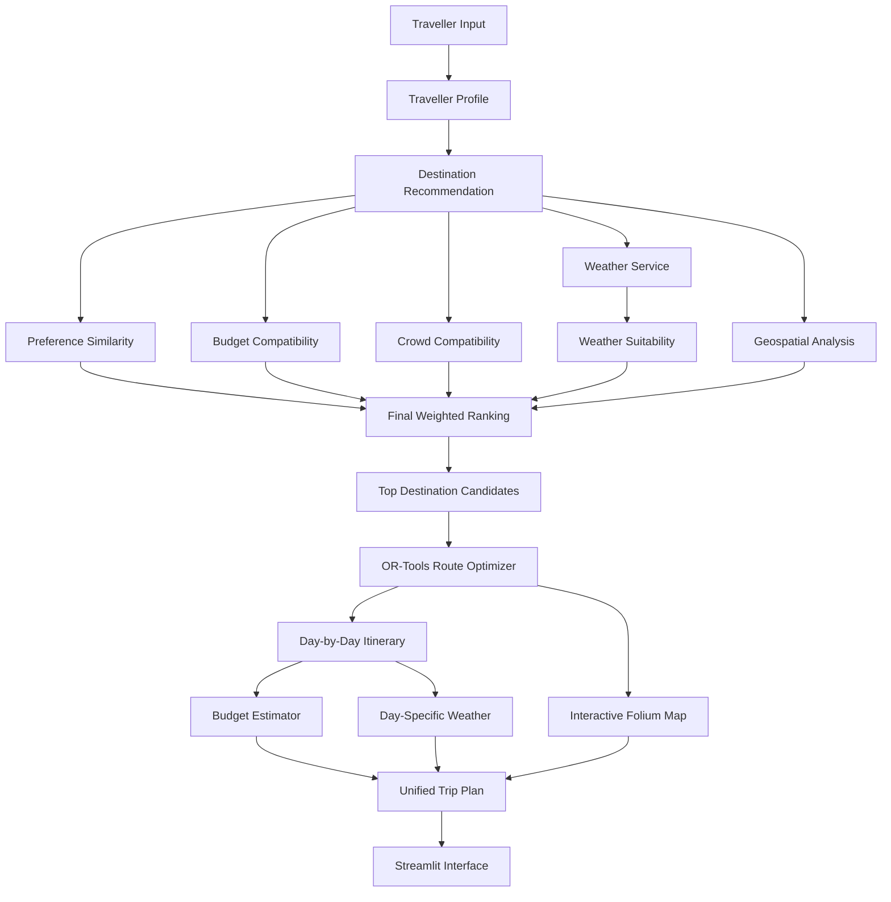

# 🇱🇰 CeylonCompass

### Smart Sri Lanka Travel Recommendation & Route Optimization Platform

CeylonCompass is a data-driven travel planning application that recommends Sri Lankan destinations based on traveller preferences, budget, crowd preference, weather conditions and geographic efficiency.

It then optimizes the travel sequence, creates a day-by-day itinerary, estimates the trip budget and visualizes the journey on an interactive map.

The project combines **recommendation systems, geospatial analysis, route optimization, explainable scoring, weather intelligence and data visualization** in one end-to-end data science application.

---

# 📸 Application Preview

## Traveller Profile

Travellers can configure:

- starting location
- number of travel days
- total budget
- travel style
- crowd preference
- transport method
- travel interests



---

## Destination Recommendations

CeylonCompass ranks destinations using multiple factors instead of relying on a single recommendation score.



The system also explains **why each destination was recommended** and highlights possible trade-offs.



---

## Route Optimization

Recommended destinations are passed to the route optimization engine to determine an efficient visiting sequence.



---

## Interactive Trip Map

The optimized destinations are displayed using Folium and OpenStreetMap with numbered route markers.



> The displayed route is a geographic visualization connecting destinations. It is not turn-by-turn road navigation.

---

## Day-by-Day Itinerary & Weather

The optimized route is converted into a daily itinerary and combined with weather information.


---

## Budget Summary

The application estimates destination and transport costs and checks whether the generated trip remains within the traveller's budget.



---

# 🎯 Project Goal

Planning a trip across Sri Lanka requires several decisions:

- Which destinations match the traveller's interests?
- Which destinations are affordable?
- Which locations match the traveller's crowd preference?
- Which destinations currently have suitable weather?
- Which destinations are geographically practical?
- What is the best order to visit them?
- Can the selected destinations fit within the available travel days?
- What will the estimated trip cost be?

CeylonCompass is designed around the following question:

> **Given a traveller's budget, number of days, interests, travel style, crowd preference, transport preference and starting location, which Sri Lankan destinations should they visit, in what order, and why?**

---

# ✨ Main Features

## Traveller Preference Profile

The traveller profile includes:

- starting point
- trip duration
- total budget
- travel style
- crowd preference
- transport preference
- selected interests

Supported interests:

- Beach
- Wildlife
- Hiking
- Nature
- Culture
- History
- Adventure

---

## Destination Recommendation Engine

Traveller interests and destination characteristics are represented as feature vectors.

CeylonCompass uses **cosine similarity** to measure how closely destinations match the selected interests.

```text
Traveller Interests
        ↓
Feature Vector
        ↓
Cosine Similarity
        ↓
Destination Preference Score
```

---

## Multi-Criteria Final Ranking

The final destination score combines five components:

| Component | Weight |
|---|---:|
| Preference similarity | 45% |
| Budget compatibility | 20% |
| Weather suitability | 15% |
| Crowd compatibility | 10% |
| Route efficiency | 10% |

```text
Final Score =
0.45 × Preference
+ 0.20 × Budget
+ 0.15 × Weather
+ 0.10 × Crowd
+ 0.10 × Route Efficiency
```

If weather information is unavailable or the traveller chooses **No Preference** for crowds, unavailable components are excluded and the remaining active weights are normalized.

---

## Explainable Recommendations

Instead of displaying only a score, CeylonCompass provides explanations such as:

- matching interests
- budget suitability
- crowd suitability
- recommendation strengths
- possible trade-offs
- component-level scores

This makes the recommendation process easier to understand.

---

## Route Efficiency

Before route optimization, geographic efficiency is considered during destination ranking.

The route-efficiency component considers:

- distance from the selected starting point
- distance between candidate destinations

The current implementation uses **Haversine great-circle distance**.

---

## OR-Tools Route Optimization

After selecting destinations, **Google OR-Tools** determines an optimized visiting sequence.

The two stages have different responsibilities:

```text
Recommendation Engine
        ↓
WHERE should the traveller visit?

Route Optimizer
        ↓
IN WHAT ORDER should they visit?
```

A nearest-neighbour algorithm is also included as a baseline for evaluating route optimization.

---

## Day-by-Day Itinerary

The optimized route is converted into a daily travel plan.

The itinerary planner:

- preserves route order
- assigns destinations to travel days
- supports an 8-hour daily activity limit
- identifies destinations that cannot fit into the available days
- adds day-specific weather information

Current V1 scheduling limits **activity time only**.

Travel time between destinations is not yet included in the daily time limit.

---

## Budget Estimation

The budget engine estimates:

- destination spending
- transport cost
- estimated total trip cost
- remaining budget
- budget deficit
- whether the itinerary stays within budget

Travel styles supported:

```text
Budget
Balanced
Comfort
```

Transport modes supported:

```text
Public Transport
Mixed Transport
Private Vehicle
```

The current cost values are transparent modelling assumptions for the V1 system and are not guaranteed real-time Sri Lankan prices.

---

## Weather Intelligence

Live weather data is retrieved using the **Open-Meteo API**.

Weather suitability considers:

| Weather Factor | Weight |
|---|---:|
| General weather condition | 40% |
| Rain probability | 30% |
| Precipitation amount | 20% |
| Temperature | 10% |

Weather information contributes to destination ranking and is also displayed in the itinerary.

---

## Interactive Map

CeylonCompass uses:

- Folium
- OpenStreetMap
- streamlit-folium

The map displays:

- traveller starting location
- selected destinations
- numbered route markers
- optimized visit sequence
- destination details
- geographic route line

---

# 🏗️ System Architecture



---

# 🔄 Planning Pipeline

```text
Traveller Profile
       ↓
Initial Recommendation
       ↓
Candidate Selection
       ↓
Weather Retrieval
       ↓
Final Weighted Ranking
       ↓
Route Candidate Selection
       ↓
OR-Tools Route Optimization
       ↓
Day-by-Day Itinerary
       ↓
Budget Estimation
       ↓
Weather + Map Integration
       ↓
Final Trip Plan
```

---

# 📊 Dataset

CeylonCompass currently contains **48 curated Sri Lankan destinations**.

Each destination contains information such as:

```text
destination_id
name
district
province
latitude
longitude
category
estimated_daily_cost_usd
recommended_duration_hours
crowd_level
beach
wildlife
hiking
nature
culture
history
adventure
fitness_requirement
family_suitability
best_months
```

Main destination categories include:

- Beach
- Heritage
- Wildlife
- Nature
- Hiking
- Culture
- Adventure

Some recommendation attributes are curated modelling inputs rather than objective ground-truth labels.

---

# 🧠 Data Science Concepts Used

## Recommendation Systems

- feature engineering
- traveller feature vectors
- destination feature vectors
- cosine similarity
- weighted scoring
- multi-criteria ranking

## Geospatial Analytics

- latitude and longitude
- Haversine distance
- distance matrices
- geographic candidate clustering

## Optimization

- Google OR-Tools
- route sequencing
- nearest-neighbour baseline

## Explainable AI

- component-level scoring
- recommendation reasons
- trade-off explanations
- transparent ranking weights

## Weather Analytics

- Open-Meteo API
- weather-code interpretation
- rainfall probability
- precipitation analysis
- temperature suitability

## Evaluation

- reproducible traveller scenarios
- deterministic weather benchmarking
- budget compliance
- itinerary compliance
- route validity
- recommendation score analysis
- category diversity
- optimizer vs baseline comparison

---

# 📈 Quantitative Evaluation

The system was evaluated using **30 fixed traveller scenarios** covering different:

- starting points
- budgets
- trip durations
- travel styles
- crowd preferences
- transport types
- traveller interests

## Evaluation Results

| Metric | Result |
|---|---:|
| Mean preference similarity | **82.63%** |
| Mean final recommendation score | **85.06%** |
| Mean category diversity | **47.33%** |
| Budget compliance | **96.67%** |
| Duration compliance | **100.00%** |
| Scheduled destination coverage | **82.38%** |
| Controlled weather coverage | **100.00%** |
| Mean controlled weather score | **80.86%** |
| Route validity | **100.00%** |
| Mean route-distance saving | **4.47%** |
| Optimizer not worse than baseline | **100.00%** |

---

## Route Optimization Evaluation

OR-Tools was compared with a nearest-neighbour baseline using the same destination sets.

Across the 30 evaluation scenarios:

```text
Average route distance saving: 4.47%
```

The optimized route was **not worse than the nearest-neighbour baseline in any evaluated scenario**.

Some routes showed almost no improvement because the nearest-neighbour solution was already efficient.

---

# ⚠️ Evaluation Notes

The evaluation metrics should be interpreted carefully.

### Preference Similarity

The **82.63% preference similarity is not recommendation accuracy**.

It measures similarity between traveller interests and curated destination feature vectors.

The project currently does not contain human-labelled recommendation relevance data.

Therefore metrics such as:

```text
Precision@K
Recall@K
NDCG
```

are not claimed yet.

### Weather Evaluation

The automated evaluation uses deterministic synthetic weather so experiments can be reproduced consistently.

The actual Streamlit application uses live **Open-Meteo** data.

---

# 🧪 Testing

The project currently contains automated tests covering:

- dataset validation
- traveller profiles
- recommendation scoring
- explanations
- Haversine distance
- route baseline
- OR-Tools optimization
- itinerary planning
- budget estimation
- weather scoring
- interactive maps
- unified planning service
- final weighted scoring
- evaluation scenarios
- evaluation metrics
- evaluation reporting

Current verified result:

```text
244 passed
```

Run the tests with:

```powershell
python -m pytest
```

---

# 📁 Evaluation Artifacts

The complete reproducible evaluation is stored in:

```text
evaluation/
├── results/
│   ├── scenario_results.csv
│   ├── segment_summary.csv
│   ├── overall_summary.json
│   └── evaluation_report.md
│
└── charts/
    ├── segment_scores.html
    ├── route_savings.html
    └── compliance_rates.html
```

Run the full evaluation again using:

```powershell
python -m notebooks.evaluation_report
```

---

# 🛠️ Technology Stack

| Area | Technology |
|---|---|
| Programming Language | Python |
| User Interface | Streamlit |
| Data Processing | pandas, NumPy |
| Machine Learning | scikit-learn |
| Route Optimization | Google OR-Tools |
| Maps | Folium |
| Map Data | OpenStreetMap |
| Weather | Open-Meteo |
| Visualization | Plotly |
| HTTP Requests | requests |
| Testing | pytest |
| Reporting | pandas, Plotly, tabulate |
| Version Control | Git & GitHub |

---

# 📂 Project Structure

```text
Ceylon-Compass/
│
├── app.py
├── README.md
├── requirements.txt
├── LICENSE
│
├── assets/
│   ├── architecture/
│   └── screenshots/
│       ├── 01-traveller_profile.png
│       ├── 02-recommendations.png
│       ├── 03-explainability.png
│       ├── 04-route_map.png
│       ├── 05-trip_map.png
│       ├── 06-itinerary_weather.png
│       └── 07-budget_summary.png
│
├── data/
│   ├── destinations.csv
│   └── README.md
│
├── evaluation/
│   ├── charts/
│   └── results/
│
├── notebooks/
│   ├── destination_analysis.py
│   ├── profile_scenarios.py
│   ├── explanation_scenarios.py
│   ├── route_comparison.py
│   └── evaluation_report.py
│
├── src/
│   ├── budget/
│   ├── evaluation/
│   ├── itinerary/
│   ├── optimization/
│   ├── planning/
│   ├── recommendation/
│   ├── utils/
│   ├── visualization/
│   └── weather/
│
└── tests/
```

---

# 🚀 Installation

## 1. Clone the Repository

```bash
git clone https://github.com/SMCodeX7/Ceylon-Compass.git
```

```bash
cd Ceylon-Compass
```

---

## 2. Create a Virtual Environment

```powershell
python -m venv .venv
```

Activate it:

```powershell
.venv\Scripts\Activate.ps1
```

---

## 3. Install Dependencies

```powershell
python -m pip install -r requirements.txt
```

---

## 4. Run the Tests

```powershell
python -m pytest
```

---

## 5. Run the Application

```powershell
streamlit run app.py
```

The application will open in your browser.

---

# 💰 Cost-Free Architecture

CeylonCompass V1 is designed to work without paid APIs.

It currently uses:

- Python
- Streamlit
- scikit-learn
- OR-Tools
- OpenStreetMap
- Folium
- Open-Meteo
- Plotly

No paid OpenAI, Gemini, Claude or Mistral API is required for V1.

---

# ⚠️ Current Limitations

CeylonCompass V1 currently has several known limitations:

1. The destination dataset contains 48 destinations.
2. Recommendation feature values are manually curated.
3. Haversine distance is used instead of actual road-network distance.
4. The map route is not turn-by-turn navigation.
5. Travel time is not included in the daily itinerary time limit.
6. Budget estimates are modelling assumptions rather than real-time market prices.
7. Budget influences ranking but is not yet a strict optimization constraint.
8. Route candidate count is not automatically adjusted for very short trips.
9. Weather is based on the available forecast horizon rather than a user-selected future travel date.
10. Human-labelled recommendation relevance data is not yet available.

---

# 🔮 Future Development

## 1. Adaptive Trip Planning

Improve destination selection based on trip duration.

For example:

```text
2-day trip  → fewer route candidates
7-day trip  → more route candidates
14-day trip → larger itinerary
```

This will improve short-trip scheduled destination coverage.

---

## 2. Budget-Constrained Destination Selection

Future versions can treat total trip budget as a hard constraint rather than only a ranking factor.

Possible approach:

```text
Maximize traveller preference
while
Total estimated trip cost <= traveller budget
```

This could be implemented using optimization techniques.

---

## 3. Road-Network Routing

Replace Haversine route estimates with actual road-network information.

Future route planning could consider:

- real driving distance
- travel duration
- road network
- transport mode
- traffic conditions

---

## 4. Travel-Time-Aware Itinerary

Future itinerary planning can combine:

```text
Activity Time
+
Travel Time
<=
Daily Travel Limit
```

This would make daily plans more realistic.

---

## 5. User-Selected Travel Dates

Allow travellers to choose actual arrival and departure dates.

This can improve:

- weather forecasting
- seasonal recommendations
- best-month analysis
- itinerary planning

---

## 6. Human Recommendation Evaluation

Collect traveller relevance ratings to enable stronger recommender-system evaluation.

Future metrics could include:

- Precision@K
- Recall@K
- NDCG
- Mean Reciprocal Rank
- user satisfaction ratings

---

## 7. Larger Destination Dataset

Expand the dataset with:

- more beaches
- historical attractions
- hiking trails
- cultural attractions
- wildlife destinations
- hidden destinations
- restaurants
- accommodation
- local experiences

---

# 🤖 Future Phase — Local AI Travel Assistant

The existing deterministic recommendation system can later be extended with a cost-free AI layer.

Possible technologies include:

- Sentence Transformers
- FAISS
- Ollama
- local LLMs
- semantic search
- RAG
- NLP traveller-profile extraction

Example:

```text
User:
"I have 5 days, around $400, love wildlife and nature,
and prefer quiet places."

        ↓

NLP Profile Extraction

        ↓

CeylonCompass Recommendation Engine

        ↓

Route Optimization

        ↓

AI Explanation

        ↓

Personalized Itinerary
```

Future AI capabilities could include:

- natural-language trip requests
- conversational itinerary editing
- semantic destination search
- automatic trip replanning
- itinerary question answering
- recommendation verification
- tool-calling travel assistant

The deterministic recommendation and optimization pipeline will remain the main planning foundation.

---

# 🧭 Design Principle

CeylonCompass separates recommendation and optimization:

> **The recommender decides WHERE to travel.**

> **The optimizer decides IN WHAT ORDER to travel.**

This separation makes the system easier to explain, test and improve.

---

# 🔬 Reproducibility

Run the complete automated test suite:

```powershell
python -m pytest
```

Run the quantitative evaluation:

```powershell
python -m notebooks.evaluation_report
```

---

# 📄 License

See the [LICENSE](LICENSE) file for licensing information.

---

# 🇱🇰 CeylonCompass

**Data-driven Sri Lanka travel planning with explainable recommendations, route optimization, weather intelligence and reproducible evaluation.**
