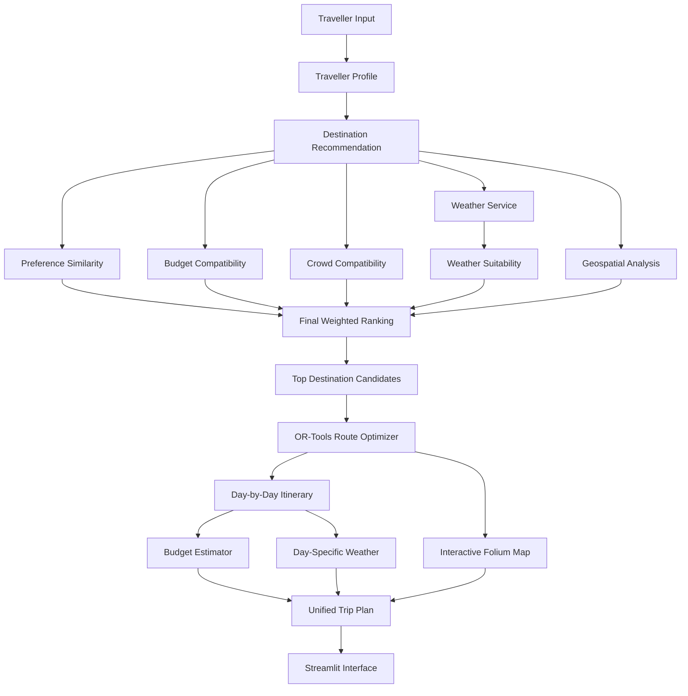

# 🇱🇰 Ceylon Compass

### Explainable Sri Lankan travel planning with recommendations, optimization and weather

### 🌐 Live Demo

**Try Ceylon Compass:**
[https://sm-ceylon-compass.streamlit.app/](https://sm-ceylon-compass.streamlit.app/)

Ceylon Compass is an explainable AI-style travel recommendation system and itinerary planner for Sri Lanka. Its recommendation layer is deterministic and score-based rather than generative: a traveller provides a Starting Location, trip duration, Trip Budget, travel style, crowd preference, transport mode and interests, and the application produces one connected plan:

1. ranked destination recommendations;
2. an optimized visiting sequence;
3. a day-by-day itinerary with forecast information; and
4. an estimated activity and transport budget.

The product is built around four practical questions:

| Traveller question | Ceylon Compass answer |
|---|---|
| **Where should I visit?** | Multi-criteria destination recommendations. |
| **In what order should I visit?** | OR-Tools route sequencing using geographic distances. |
| **Why was this recommended?** | Component scores, reasons, trade-offs and active weights. |
| **How much will it cost and what is the itinerary?** | Daily scheduling, weather details and transparent budget estimates. |

This is a deterministic, data-driven planning application. It does not use a generative AI model, claim turn-by-turn navigation, or present estimated costs as live market prices.

---

## At a Glance

| Area | Implementation |
|---|---|
| **Technology stack** | Python, Streamlit, pandas, NumPy, scikit-learn, Folium and pytest |
| **AI capabilities** | Deterministic explainable scoring using feature vectors, cosine similarity, component scores and recommendation reasons |
| **Optimization** | Google OR-Tools route sequencing with Haversine geographic distances |
| **Weather intelligence** | Open-Meteo forecast retrieval and weather suitability scoring |
| **Budget planning** | Transparent activity and transport cost estimates with budget comparison |
| **Live demo** | [Open the Streamlit application](https://sm-ceylon-compass.streamlit.app/) |

---

## Application Workflow

The Streamlit interface presents the workflow as one journey rather than separate demos:

1. **Traveller profile:** configure the constraints and preferences that drive the plan.
2. **Recommendations:** inspect the ranked destinations and expand a card to see its reasoning.
3. **Route experience:** review the recommended visit order, geographic distance summary and interactive map.
4. **Itinerary and weather:** see which destinations fit each day and the forecast assigned to each scheduled stop.
5. **Budget:** review estimated destination and transport costs, budget usage and modelling assumptions.

The generated page is designed to make the relationship between each stage visible: recommendations decide **where** to go, the optimizer decides **in what order**, and the itinerary and budget explain what the resulting trip looks like.

---

# 🎯 Project Goal

Planning a multi-destination trip across Sri Lanka involves several decisions:

- Which destinations match the traveller's interests?
- Which destinations fit the available budget?
- Which places match the traveller's preferred crowd level?
- Which destinations currently have suitable weather?
- Which locations are geographically practical?
- In what order should the destinations be visited?
- Can they fit within the available number of travel days?
- What will the estimated trip cost be?

Ceylon Compass is designed around the following question:

> **Given a traveller's budget, number of days, interests, travel style, crowd preference, transport preference and starting location, which Sri Lankan destinations should they visit, in what order, and why?**

---

# ✨ Main Features

## 1. Traveller Profile: Define the Trip

The input panel captures the constraints used by the planning pipeline:

- Starting Location
- Trip duration
- Trip Budget
- Travel style
- Crowd preference
- Transport preference
- Selected interests

Supported interests:

- Beach
- Wildlife
- Hiking
- Nature
- Culture
- History
- Adventure

---

## 2. Destination Recommendations: Where Should I Visit?

Traveller interests and destination characteristics are represented as feature vectors. Cosine similarity produces the preference component of the ranking.

```text
Traveller Interests
        ↓
Feature Vector
        ↓
Cosine Similarity
        ↓
Destination Preference Score
```

---

## 3. Explainable Ranking: Why Was This Recommended?

The final score combines five components:

| Component | Weight |
|---|---:|
| Preference similarity | 45% |
| Budget compatibility | 20% |
| Weather suitability | 15% |
| Crowd compatibility | 10% |
| Route efficiency | 10% |

The ranking model is:

```text
Final Score =
0.45 × Preference
+ 0.20 × Budget
+ 0.15 × Weather
+ 0.10 × Crowd
+ 0.10 × Route Efficiency
```

If Weather Information is unavailable, that component is excluded and the remaining active weights are normalized.

If the traveller selects **No Preference** for crowds, the crowd component is also excluded instead of giving all destinations an artificial perfect crowd score.

---

For the top recommendations, the current UI shows:

- Matching traveller interests
- Budget suitability
- Crowd compatibility
- Weather suitability
- Route efficiency
- Recommendation reasons
- Possible trade-offs
- Active score weights

This makes each recommendation inspectable instead of presenting an unexplained rank.

---

## 4. Geographic Route Efficiency

Geographic efficiency is considered during destination ranking.

The current route-efficiency score considers:

- Distance from the traveller's starting location
- Relative distance between candidate destinations

The implementation currently uses **Haversine great-circle distance**.

This helps reduce the chance of selecting destinations that are individually relevant but geographically impractical as one trip.

---

## 5. Route Optimization: In What Order Should I Visit?

After destination selection, **Google OR-Tools** determines an optimized visiting sequence.

The recommendation and optimization stages have separate responsibilities:

```text
Recommendation Engine
        ↓
WHERE should the traveller visit?

Route Optimizer
        ↓
IN WHAT ORDER should they visit?
```

The project also includes a nearest-neighbour route baseline for quantitative comparison.

---

## 6. Day-by-Day Itinerary: What Fits Each Day?

The optimized route is converted into a daily itinerary.

The itinerary planner:

- Preserves optimized route order
- Assigns destinations to trip days
- Uses an 8-hour daily activity limit
- Identifies destinations that cannot fit into the available days
- Adds day-specific Weather Information

Current V1 scheduling limits **activity time only**.

Travel time between destinations is not yet included in the daily time constraint.

---

## 7. Budget-Aware Planning: How Much Will It Cost?

The budget engine estimates:

- Destination spending
- Transport cost
- Estimated total trip cost
- Remaining budget
- Budget deficit
- Whether the trip stays within budget

Travel styles:

```text
Budget
Balanced
Comfort
```

Transport modes:

```text
Public Transport
Mixed Transport
Private Vehicle
```

The current cost values are transparent modelling assumptions used by the V1 system and are not guaranteed real-time Sri Lankan prices.

---

## 8. Weather Intelligence: What Conditions Should I Expect?

Ceylon Compass uses the **Open-Meteo API** for Weather Information.

Weather suitability considers:

| Weather Factor | Weight |
|---|---:|
| General weather condition | 40% |
| Rain probability | 30% |
| Precipitation amount | 20% |
| Temperature | 10% |

Weather contributes to destination ranking and is also displayed inside the generated itinerary.

Weather forecasts are cached temporarily to reduce unnecessary API calls.

---

## 9. Interactive Travel Map

Ceylon Compass uses:

- Folium
- OpenStreetMap
- streamlit-folium

The map displays:

- Traveller starting location
- Selected destinations
- Numbered route markers
- Optimized visit sequence
- Destination details
- Geographic route line

---

# 🏗️ System Architecture



---

# 🔄 Planning Pipeline

```text
Traveller Profile
       ↓
Initial Recommendation
       ↓
Candidate Selection
       ↓
Weather Retrieval
       ↓
Final Weighted Ranking
       ↓
Route Candidate Selection
       ↓
OR-Tools Route Optimization
       ↓
Day-by-Day Itinerary
       ↓
Budget Estimation
       ↓
Weather + Map Integration
       ↓
Final Trip Plan
```

---

# 📊 Dataset

Ceylon Compass currently contains **48 curated Sri Lankan destinations**.

Each destination includes fields such as:

```text
destination_id
name
district
province
latitude
longitude
category
estimated_daily_cost_usd
recommended_duration_hours
crowd_level
beach
wildlife
hiking
nature
culture
history
adventure
fitness_requirement
family_suitability
best_months
```

Main destination categories:

- Beach
- Heritage
- Wildlife
- Nature
- Hiking
- Culture
- Adventure

Some recommendation-related features such as interest strengths and crowd levels are **curated modelling inputs** rather than objective ground-truth labels.

---

# 🧠 Technical Highlights

Ceylon Compass combines several focused components rather than hiding the planning process behind a single opaque score:

## Recommendation Systems

- Feature engineering
- Traveller feature vectors
- Destination feature vectors
- Cosine similarity
- Weighted scoring
- Multi-criteria ranking

## Geospatial Analytics

- Latitude and longitude
- Haversine distance
- Distance matrices
- Geographic candidate proximity

## Optimization

- Google OR-Tools
- Route sequencing
- Nearest-neighbour baseline

## Explainable AI-Style Scoring

- Component-level scoring
- Recommendation reasons
- Trade-off explanations
- Transparent ranking weights
- Deterministic outputs that can be inspected and tested

## Weather Analytics

- Open-Meteo API
- Weather-code interpretation
- Rainfall probability
- Precipitation analysis
- Temperature suitability

## Evaluation and Reproducibility

- Reproducible traveller scenarios
- Deterministic weather benchmarking
- Budget compliance
- Itinerary compliance
- Route validity
- Recommendation score analysis
- Category diversity
- Optimizer vs baseline comparison

---

# 📈 Quantitative Evaluation

Ceylon Compass V1 was evaluated using **30 fixed traveller scenarios** covering different:

- Starting locations
- Budgets
- Trip durations
- Travel styles
- Crowd preferences
- Transport modes
- Traveller interests

## Evaluation Results

| Metric | Result |
|---|---:|
| Mean preference similarity | **82.63%** |
| Mean final recommendation score | **85.06%** |
| Mean category diversity | **47.33%** |
| Budget compliance | **96.67%** |
| Duration compliance | **100.00%** |
| Scheduled destination coverage | **82.38%** |
| Controlled weather coverage | **100.00%** |
| Mean controlled weather score | **80.86%** |
| Route validity | **100.00%** |
| Mean route-distance saving | **4.47%** |
| Optimizer not worse than baseline | **100.00%** |

---

## Route Optimization Evaluation

OR-Tools was compared with a nearest-neighbour baseline using the same destination sets.

Across the 30 evaluation scenarios:

```text
Average route distance saving: 4.47%
```

The optimized route was **not worse than the nearest-neighbour baseline in any evaluated scenario**.

Some scenarios showed little or no improvement because the nearest-neighbour route was already efficient.

---

# ⚠️ Evaluation Notes

## Preference Similarity

The **82.63% preference similarity score is not recommendation accuracy**.

It measures cosine similarity between traveller interests and curated destination feature vectors.

The project currently does not contain human-labelled recommendation relevance data.

Therefore metrics such as:

```text
Precision@K
Recall@K
NDCG
```

are not claimed yet.

## Weather Evaluation

The automated evaluation uses **deterministic synthetic weather** so experiments can be reproduced consistently.

This evaluates planner behaviour, not Open-Meteo forecast accuracy.

The deployed Streamlit application itself uses live Open-Meteo forecast data.

---

# 🧪 Testing

Automated tests currently cover:

- Dataset validation
- Traveller profiles
- Recommendation scoring
- Explainability
- Haversine distance
- Route baseline
- OR-Tools optimization
- Itinerary planning
- Budget estimation
- Weather processing
- Interactive maps
- Unified planning service
- Final weighted scoring
- Evaluation scenarios
- Evaluation metrics
- Evaluation reporting

Current verified result:

```text
244 passed
```

Run the complete test suite with:

```powershell
python -m pytest
```

---

# 📁 Evaluation Artifacts

Evaluation outputs are stored under:

```text
evaluation/
├── results/
│   ├── scenario_results.csv
│   ├── segment_summary.csv
│   ├── overall_summary.json
│   └── evaluation_report.md
│
└── charts/
    ├── segment_scores.html
    ├── route_savings.html
    └── compliance_rates.html
```

Run the complete quantitative evaluation with:

```powershell
python -m notebooks.evaluation_report
```

---

# 🛠️ Technology Stack

| Area | Technology |
|---|---|
| Programming Language | Python |
| User Interface | Streamlit |
| Data Processing | pandas, NumPy |
| Machine Learning | scikit-learn |
| Route Optimization | Google OR-Tools |
| Maps | Folium |
| Map Data | OpenStreetMap |
| Weather | Open-Meteo |
| Visualization | Plotly |
| HTTP Requests | requests |
| Testing | pytest |
| Reporting | pandas, Plotly, tabulate |
| Version Control | Git & GitHub |
| Deployment | Streamlit Community Cloud |

---

# 📂 Project Structure

```text
Ceylon-Compass/
│
├── app.py
├── README.md
├── requirements.txt
├── LICENSE
│
├── data/
│   ├── destinations.csv
│   └── README.md
│
├── evaluation/
│   ├── charts/
│   └── results/
│
├── notebooks/
│   ├── destination_analysis.py
│   ├── profile_scenarios.py
│   ├── explanation_scenarios.py
│   ├── route_comparison.py
│   └── evaluation_report.py
│
├── src/
│   ├── budget/
│   ├── evaluation/
│   ├── itinerary/
│   ├── optimization/
│   ├── planning/
│   ├── recommendation/
│   ├── utils/
│   ├── visualization/
│   └── weather/
│
└── tests/
```

---

# 🚀 Installation

## 1. Clone the Repository

```bash
git clone https://github.com/SMCodeX7/Ceylon-Compass.git
```

```bash
cd Ceylon-Compass
```

## 2. Create a Virtual Environment

```powershell
python -m venv .venv
```

Activate it:

```powershell
.venv\Scripts\Activate.ps1
```

## 3. Install Dependencies

```powershell
python -m pip install -r requirements.txt
```

## 4. Run Tests

```powershell
python -m pytest
```

## 5. Start the Application

```powershell
streamlit run app.py
```

The application will open in the browser.

---

# 🌐 Deployment

Ceylon Compass V1 is publicly deployed using **Streamlit Community Cloud**.

### Live Application

[https://sm-ceylon-compass.streamlit.app/](https://sm-ceylon-compass.streamlit.app/)

Deployment configuration:

```text
Platform: Streamlit Community Cloud
Repository: SMCodeX7/Ceylon-Compass
Branch: main
Main file: app.py
Python: 3.14
```

The deployed application does not require paid API keys.

---

# 💰 Cost-Free Architecture

Ceylon Compass V1 is intentionally designed to work without paid APIs.

It currently uses:

- Python
- Streamlit
- scikit-learn
- OR-Tools
- OpenStreetMap
- Folium
- Open-Meteo
- Plotly

No paid OpenAI, Gemini, Claude or Mistral API is required for the current V1 application.

---

# ⚠️ Current Limitations

Ceylon Compass V1 currently has several known limitations:

1. The dataset contains 48 destinations.
2. Recommendation feature values are manually curated.
3. Haversine distance is used instead of actual road-network distance.
4. The map route is not turn-by-turn navigation.
5. Travel time is not included in the daily itinerary time limit.
6. Budget estimates are modelling assumptions rather than real-time market prices.
7. Budget influences recommendation ranking but is not yet a strict trip-level optimization constraint.
8. Route candidate count is not automatically adjusted for very short trips.
9. Weather uses the available forecast horizon rather than a user-selected future departure date.
10. Human-labelled recommendation relevance data is not yet available.

---

# 🔮 Future Development

## 1. Adaptive Trip Planning

The number of selected destinations can be adjusted automatically based on trip duration.

Example:

```text
2-day trip  → fewer route candidates
7-day trip  → medium route candidate set
14-day trip → larger route candidate set
```

This can improve itinerary coverage for short trips.

---

## 2. Budget-Constrained Destination Selection

Future versions can treat total trip budget as a hard optimization constraint.

For example:

```text
Maximize traveller preference
subject to
Estimated trip cost <= traveller budget
```

---

## 3. Road-Network Routing

Replace Haversine distance with actual road-network routing.

Future routing could consider:

- Driving distance
- Travel duration
- Road network
- Transport mode
- Traffic conditions

---

## 4. Travel-Time-Aware Itinerary

Future itinerary planning can use:

```text
Activity Time
+
Travel Time
<=
Daily Travel Limit
```

This would make daily plans more realistic.

---

## 5. User-Selected Travel Dates

Travellers could select actual arrival and departure dates.

This would improve:

- Weather forecasting
- Seasonal recommendations
- Best-month analysis
- Day-specific itinerary planning

---

## 6. Human Recommendation Evaluation

Collect traveller relevance ratings and feedback.

This would allow stronger recommendation-system evaluation using:

- Precision@K
- Recall@K
- NDCG
- Mean Reciprocal Rank
- User satisfaction scores

---

## 7. Larger Destination Dataset

The destination dataset can be expanded with:

- More beaches
- Historical attractions
- Hiking trails
- Wildlife destinations
- Cultural attractions
- Hidden destinations
- Restaurants
- Accommodation
- Local experiences

---

# 🤖 Future Phase — AI Travel Assistant

A future cost-free AI layer can be built on top of the current deterministic planning engine.

Possible technologies include:

- Sentence Transformers
- FAISS
- Ollama
- Local LLMs
- Semantic search
- RAG
- NLP profile extraction

Example:

```text
User:
"I have 5 days, around $400,
love wildlife and nature,
and prefer quiet places."

        ↓

NLP Profile Extraction

        ↓

Ceylon Compass Recommendation Engine

        ↓

Route Optimization

        ↓

AI Explanation

        ↓

Personalized Itinerary
```

Possible future AI capabilities:

- Natural-language trip requests
- Conversational itinerary editing
- Semantic destination search
- Automatic trip replanning
- Travel question answering
- Recommendation verification
- Tool-calling travel assistant

The current deterministic recommendation and optimization pipeline will remain the reliable planning foundation underneath the AI layer.

---

# 🧭 Design Principle

Ceylon Compass separates recommendation from optimization:

> **The recommender decides WHERE to travel.**

> **The optimizer decides IN WHAT ORDER to travel.**

This makes the system easier to explain, evaluate, test and improve.

---

# 🔬 Reproducibility

Run the automated test suite:

```powershell
python -m pytest
```

Run the complete quantitative evaluation:

```powershell
python -m notebooks.evaluation_report
```

---

# 📄 License

See the [LICENSE](LICENSE) file for licensing information.

---

# 🇱🇰 Ceylon Compass

**Data-driven Sri Lanka travel planning with explainable recommendations, route optimization, weather intelligence and reproducible evaluation.**

🌐 **Live Demo:**  
[https://sm-ceylon-compass.streamlit.app/](https://sm-ceylon-compass.streamlit.app/)
